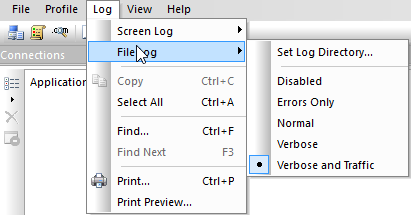
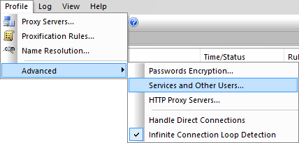
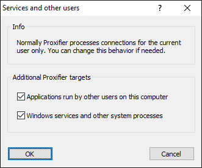
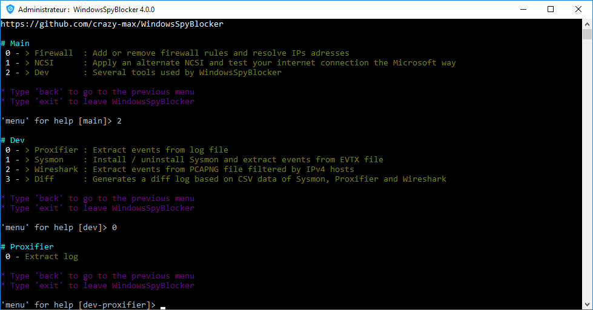

# Proxifier

!!! info
    [Proxifier](https://www.proxifier.com/) is an advanced proxy client that allows network applications that do not
    support working through proxy servers to operate through a SOCKS or HTTPS proxy and chains.

## Capture

To capture/log traffic with this application, you will have to enable verbose and traffic log file:



Then you have to allow capture of services and applications run by other users :





The log will be available by default in `C:\Users\<username>\Proxifier\Log.txt`:

```text
[2016.05.29 02:48:49]
[2016.05.29 02:48:49]     Welcome to Proxifier v3.29
[2016.05.29 02:48:49]
[2016.05.29 02:48:49] Verbose output enabled.
[2016.05.29 02:48:49] Log file enabled C:\Users\<username>\Documents\Proxifier\Log.txt
[2016.05.29 02:48:49] Traffic log enabled C:\Users\<username>\Documents\Proxifier\Traffic\
[2016.05.29 02:49:04] svchost.exe (820, System) *64 - resolve win10.ipv6.microsoft.com. : DNS
[2016.05.29 02:49:14] svchost.exe (820, System) *64 - resolve sls.update.microsoft.com : DNS
[2016.05.29 02:49:14] svchost.exe (820) *64 - sls.update.microsoft.com:443 matching Default rule : direct connection
[2016.05.29 02:49:15] svchost.exe (820, System) *64 - resolve sls.update.microsoft.com : DNS
[2016.05.29 02:49:15] svchost.exe (820) *64 - sls.update.microsoft.com:443 matching Default rule : direct connection
[2016.05.29 02:49:15] svchost.exe (1352, System) *64 - resolve v10.vortex-win.data.microsoft.com : DNS
[2016.05.29 02:49:15] svchost.exe (1352, System) *64 - v10.vortex-win.data.microsoft.com:443 matching Default rule : direct connection
[2016.05.29 02:49:16] svchost.exe (820, System) *64 - resolve login.live.com : DNS
[2016.05.29 02:49:16] svchost.exe (820) *64 - login.live.com:80 matching Default rule : direct connection
[2016.05.29 02:49:16] svchost.exe (820, System) *64 - resolve login.live.com : DNS
[2016.05.29 02:49:16] svchost.exe (820) *64 - login.live.com:443 matching Default rule : direct connection
[2016.05.29 02:49:17] svchost.exe (820, System) *64 - resolve fe3.delivery.mp.microsoft.com : DNS
[2016.05.29 02:49:17] svchost.exe (820) *64 - fe3.delivery.mp.microsoft.com:443 matching Default rule : direct connection
[2016.05.29 02:49:21] svchost.exe (820, System) *64 - resolve login.live.com : DNS
```

## Parsing

WindowsSpyBlocker can be used to parse logs and generate CSV files.

!!! warning
    Do not forget to edit the `app.conf` file before continuing
    
    * **proxifier**
        * **logPath**: Path to Proxifier log file (replace `<username>`).
    * **exclude**
        * **ips**: exclude IPs addresses from parsing. Ranges are allowed and in most cases you have to exclude your local network.
        * **hosts**: exclude domains from parsing. Wildcard are allowed and in most cases you have to exclude your local network.
        * **orgs**: exclude by whois organization from parsing. Wildcard are allowed and in most cases you have to exclude your ISP.

Launch `WindowsSpyBlocker.exe` and select `Dev > Proxifier > Extract log`:



CSV files will be generated in `logs/` folder:

* `proxifier-all.csv`
* `proxifier-hosts-count.csv`
* `proxifier-unique.csv`
