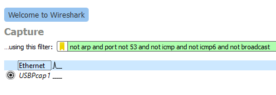

# Wireshark

!!! info
    [Wireshark](https://www.wireshark.org/) is the well known network protocol analyzer.
    [Visual C++ Redistributable Packages for Visual Studio 2013](https://www.microsoft.com/en-us/download/details.aspx?id=40784)
    is required to capture and list network devices.

## Capture

### With WindowsSpyBlocker

WindowsSpyBlocker can be used to capture traffic on your network interface. A lite version of Wireshark is embedded in
WindowsSpyBlocker.

!!! warning
    Do not forget to edit the `app.conf` file before continuing.
    
    * **wireshark**
        * **capture**
            * **interface**: idx of interface used by Wireshark
            * **filter**: packet filter in libpcap filter syntax

The idx of the interface can be found be launching `WindowsSpyBlocker.exe` and
select `Dev > Wireshark > Print list of network interfaces`:


Then go to `Dev > Wireshark > Capture` to capture packets:


### With Wireshark GUI

To capture / log traffic with this application, you will have to select the correct adapter and enter a filter:



!!! note
    * Filter: `not arp and port not 53 and not icmp and not icmp6 and not broadcast`
    * Adapter: **Ethernet**

Then click on your adapter to start the capture. When the capture is done, do not forget to save your capture
as **pcapng** format.

### With command line

```text
@ECHO OFF

"C:\Program Files\Wireshark\dumpcap.exe" -i 1 -f "not arp and port not 53 and not icmp and not icmp6 and not broadcast" -w "C:\tmp\cap.pcapng"
```

!!! tip
    Where `-i 1` is the number of your adapter (here Ethernet)

## Parsing

WindowsSpyBlocker can be used to parse events and generate CSV files. Before executing the script, do not forget
to edit the `app.conf` file.

!!! warning
    Do not forget to edit the `app.conf` file before continuing.
    
    * **wireshark**
        * **pcapngPath**: Path to your capture file pcapng.
    * **exclude**
        * **ips**: exclude IPs addresses from parsing. Ranges are allowed and in most cases you have to exclude your local network.
        * **hosts**: exclude domains from parsing. Wildcard are allowed and in most cases you have to exclude your local network.
        * **orgs**: exclude by whois organization from parsing. Wildcard are allowed and in most cases you have to exclude your ISP.

Launch `WindowsSpyBlocker.exe` and select `Dev > Wireshark > Extract log`:


CSV file will be generated in `logs/` folder:

* `wireshark-hosts-count.csv`
